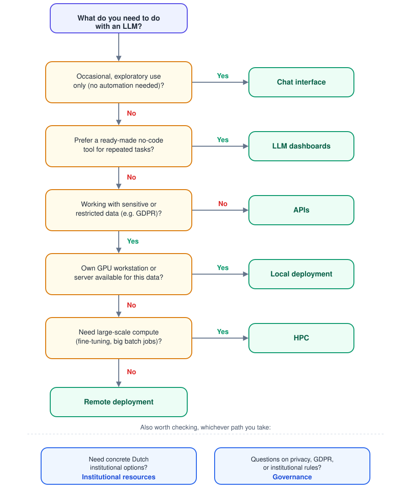

# The SoDa Guide to LLM Computing Infrastructure in the Netherlands

This guide helps researchers in the Netherlands choose a practical way to use large language models (LLMs) in research. It starts with simple, low-effort options such as chat tools and moves toward more complex infrastructure such as APIs, local or remote deployments, and high-performance computing (HPC).

The guide is created and maintained by the [ODISSEI Social Data Science (SoDa) team](https://odissei-soda.nl/). [Qixiang Fang](https://github.com/fqixiang) is the project lead and contact person.

It is for researchers who want to:

- understand the main ways to use LLMs in research;
- decide when a simple tool is enough and when more control is needed;
- identify Dutch institutional options when privacy, sensitive data, governance, or scale matter.

## What You Will Find Here

- **How to use LLMs in research**: a progression from chat to dashboards, APIs, deployments, and HPC. As you move down the decision tree, setup, technical complexity, and infrastructure control generally increase.
- **Institutional resources**: Dutch university and national infrastructure options, including when they are useful for privacy-sensitive work, restricted data, procurement, access support, or larger compute needs.
- **Governance**: guidance on GDPR, institutional rules, and responsible use of LLMs with research data.

## How To Read This Guide

If you are new to the guide, start with the [decision tree](#decision-tree). It points you to the chapter that best matches your task, data, and technical needs.

---

## Social Science and Humanities Research with LLMs

Among other disciplines, LLMs are increasingly used across the social sciences and humanities (SSH), from digitizing historical archives to coding open-ended survey responses and analyzing legal or policy texts. Below are example research projects from the [ODISSEI Social Data Science (SoDa)](https://odissei-soda.nl/) team that illustrate how LLMs can support SSH research:

- **[BiodiversityASSET](https://github.com/sodascience/BiodiversityASSET)** — LLM-powered analysis of biodiversity-related investment activities in financial reports.
- **[Future Time Orientation and Life Project](https://github.com/sodascience/LifeProject)** — A large-scale LLM pipeline to automatically classify life goals expressed in text into theoretically defined life domains across 15 cultures.
- **[LLMs for Self-Regulated Learning](https://odissei-soda.nl/projects/)** — Applying LLMs to measure the quality of self-regulated learning behaviors reflected in conversation data from higher education students.
- **[Judicial Signals](https://github.com/sodascience/judicial_signals)** — An NLP pipeline for legal texts, studying the separation of powers between the judiciary and the legislature in practice.
- **[Historical Disease Database](https://github.com/sodascience/disease_database)** — Building a historical database of diseases such as cholera for Dutch municipalities, based on 19th- and 20th-century newspaper archives (Delpher). 

For more examples, see the [SoDa projects overview](https://odissei-soda.nl/projects/).

---

## Chapter Overview { #chapter-overview }

### [How to use LLMs in research](./how-to-use-llms/overview.md)
Compare six ways of working with LLMs:

> **chat -> dashboards -> APIs -> local deployment -> remote deployment -> HPC**

The order matters: moving to the right generally requires more setup and technical expertise, but also provides more control over data flows, models, automation, compute scale, and computing resources.

Each page explains what the option is, when to use it, when not to use it, how it works, example tools, typical workflows, pros and cons, and learning resources.

### [Institutional resources](./institutional-resources/overview.md)
Focuses on infrastructure and support available in the Netherlands, including university services, SURF infrastructure, and national HPC resources.

This chapter is most useful when your project involves personal data, sensitive or restricted data, institutional approval, procurement, shared team access, long-running workflows, or compute needs beyond a laptop.

### [Governance](./governance/overview.md)
Explains data and privacy governance for LLM use at Dutch universities and at national and EU levels.

## Which Chapter/Page Should You Read First? { #decision-tree }

Not sure where to start? Use this decision tree to find the page that matches your situation.

<!-- #### Glossary
> A list of terms referred to in this infrastructure guide, with explanations.  -->
